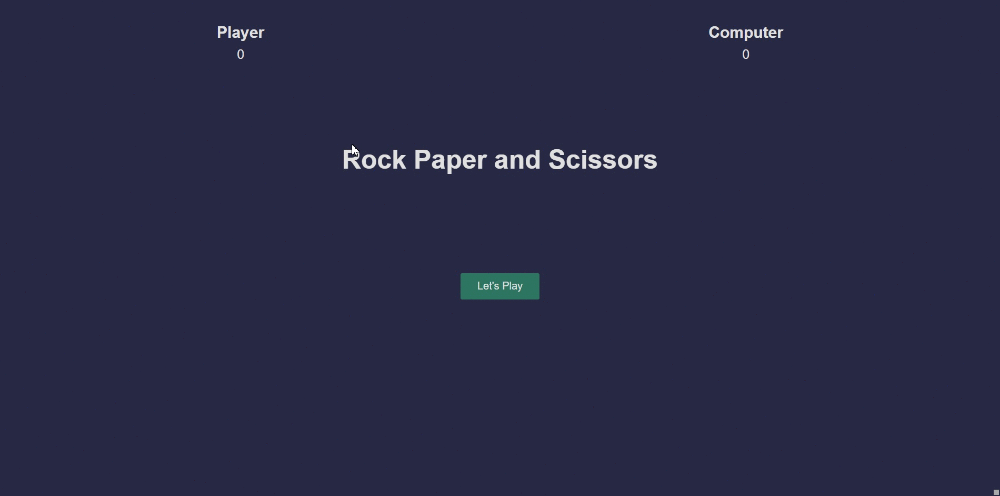

<p align="center">
<a href="https://www.linkedin.com/in/ahmet-ayd%C4%B1n-2583b1199/" target="_blank"></a>
</p>


# Rock Paper Scissors Game

## Table of contents

- [Overview](#overview)
  - [The challenge](#the-challenge)
  - [Screenshot](#screenshot)
  - [Links](#links)
- [My process](#my-process)
  - [Built with](#built-with)
  - [What I learned](#what-i-learned)
  - [Continued development](#continued-development)
  - [Useful resources](#useful-resources)
- [Author](#author)


## Overview

### The challenge

The challenge is to create a game with javascript skills.

### Screenshot

<p align="center">
<a href="https://bavi-boop.github.io/rock-paper-scissors-js/"></a>
</p>


### Links

- [live site URL here: ([Live Website)](https://bavi-boop.github.io/rock-paper-scissors-js/)

### Skeleton
```
  team-members-page(folder)
|
|----readme.md        
|----/assets # Contains hand shaped        
|----index.html  
|----style.css   
        
```
## My process

### Built with
Styled Components - For styles
- JS DOM
- JS Functions
- CSS Animations
- Semantic HTML5 markup
- CSS custom properties
- Flexbox
- CSS Grid
- Mobile-first workflow

- [Styled Components](https://styled-components.com/) - For styles


### What I learned

I learned how to use Javascript DOM Manipulation, flexboxes, media queries, html elements and many more.

To see how you can add code snippets, see below:

```JS
  // call all the inner functions
  startGame();
  playMatch();
  updateScore()
};

//start the game function
game();
```

```CSS
.proud-of-this-css {
  @keyframes shakePlayer {
  0%{
    transform: rotateY(180deg) translateY(0px);
  }
  15%{
    transform: rotateY(180deg) translateY(-50px);
  }

  25%{
    transform: rotateY(180deg) translateY(0px);
  }
  35%{
    transform: rotateY(180deg) translateY(-50px);
  }

  50%{
    transform: rotateY(180deg) translateY(0px);
  }
  65%{
    transform: rotateY(180deg) translateY(-50px);
  }

  75%{
    transform: rotateY(180deg) translateY(0px);
  }
  85%{
    transform: rotateY(180deg) translateY(-50px);
  }
  100%{
    transform: rotateY(180deg) translateY(-50px);
  }
}
}
```
```css
- You can apply all the technologies you learn. (Flexbox, Grid)
- Set a background and define font color
- Set container background color and margin
- Define others color-size-padding etc...

```


### Continued development

I will build backend and extra pages for this website in the future.

**Note: Delete this note and the content within this section and replace with your own plans for continued development.**

### Useful resources

- [W3 Schoold](https://www.w3schools.com/) - This helped me for basics of website paradigm. I really liked this pattern and will use it going forward.
- [MDN](https://developer.mozilla.org/en-US/) - This is an amazing document which helped me finally understand deep sides of web development. I'd recommend it to anyone still learning these concepts.
- [Tutorial](https://www.youtube.com/watch?v=qWPtKtYEsN4) - This helped me to complete the project. You can have a look at the tutorial


## Author

- Author - [Ahmet]
